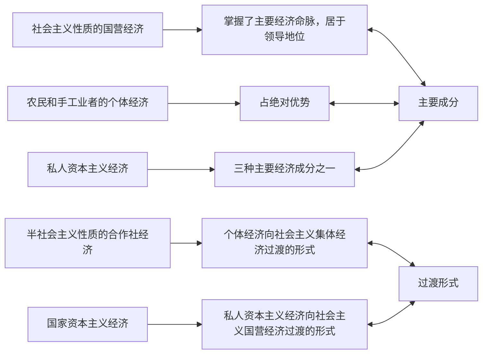

# 一、新民主主义社会是一个过渡性的社会
## （一）新民主主义理论的发展
新中国成立后，毛泽东在理论上的一个重大贡献，就是提出了从新民主主义到社会主义过渡的理论，这是对新民主主义理论的发展。
## （二）新民主主义社会是属于社会主义体系的过渡性的社会%%高频%%%%重要%%
1. 新民主主义社会是由新民主主义向社会主义转变的过渡性的社会形态。从1949年中华人民共和国成立到1956年年底社会主义改造基本完成，是我国从新民主主义到社会主义过渡的时期。这一时期，我国社会的性质是新民主主义社会。新民主主义社会不是一个独立的社会形态，而是由新民主主义转变到社会主义的过渡性的社会。 ^quo11y
2. 新民主主义社会的经济成分。在新民主主义社会中，存在着五种经济成分：社会主义性质的国营经济、半社会主义性质的合作社经济、农民和手工业者的个体经济、私人资本主义经济和国家资本主义经济。其中半社会主义性质的合作社经济是个体经济向社会主义集体经济过渡的形式，国家资本主义经济是私人资本主义经济向社会主义国营经济过渡的形式。所以，主要的经济成分是三种：社会主义经济、个体经济和资本主义经济。在这些经济成分中，通过没收官僚资本而形成的社会主义的国营经济，掌握了主要经济命脉，居于领导地位。而以农业和手工业为主体的个体经济，则在国民经济中占绝对优势。新民主主义社会要继续向前发展，就要不断扩大国营经济，同时逐步将资本主义经济和个体经济改变为社会主义经济，使社会主义经济逐步成为我国的经济基础。  ^8b9hzf

^cqv502

3. 新民主主义社会的阶级构成与主要矛盾。与新民主主义时期三种不同性质的主要经济成分相联系，中国社会的阶级构成主要有工人阶级、农民阶级和其他小资产阶级、民族资产阶级等基本的阶级力量。由于农民和手工业者的个体经济既可以自发地走向资本主义，也可以被引导走向社会主义，其本身并不代表一种独立的发展方向。所以，这三种基本的经济成分及与之相联系的三种基本的阶级力量之间的矛盾，就集中表现为资本主义和社会主义两条道路、资产阶级和工人阶级两个阶级的矛盾。随着土地改革的基本完成（1952年年底），工人阶级和资产阶级的矛盾逐步成为国内的主要矛盾。而解决这一矛盾，必然使中国社会实现向社会主义的转变。这一时期的民族资产阶级仍然是一个具有两面性的阶级：既有剥削工人取得利润的一面，又有拥护宪法、愿意接受社会主义改造的一面，因此，民族资产阶级与工人阶级的矛盾也具有两重性，既有剥削者与被剥削者的阶级利益相互对立的对抗性的一面，又有相互合作、具有相同利益的非对抗性的一面。对于工人阶级和社会主义革命来说，民族资产阶级作为一个剥削阶级是被消灭的对象，作为可以接受共产党和工人阶级领导的社会力量，又是团结和改造的对象。
 ^fa1hya
4. 新民主主义社会是属于社会主义体系的，是逐步过渡到社会主义社会的过渡性质的社会。在我国新民主主义社会中，虽然非社会主义因素仍有很大的比重，但社会主义的因素不论在经济上还是在政治上都已经居于领导地位，加上当时有利于发展社会主义的国际条件，决定了社会主义因素将不断增长并获得最终胜利，非社会主义因素将不断受到限制和改造。社会主义因素与资本主义因素之间，不可避免地存在着限制与反限制、改造与反改造的斗争。这种斗争的结果，决定着中国社会在一定历史条件下的发展方向。为了促进社会生产力的进一步发展，为了实现国家富强、民族复兴、人民幸福，我国新民主主义社会必须适时地逐步过渡到社会主义社会。

>**拓展与点拨**
新民主主义社会：国营经济居于领导地位（掌握主要经济命脉），个体经济占绝对优势。社会主义初级阶段：社会主义经济成分占绝对优势，公有制成为我国社会的经济基础。

>**经典真题**
1．（2017年单选第5题）从中华人民共和国成立到社会主义改造基本完成，是我国从新民主主义到社会主义的过渡时期。这一时期，个体经济向社会主义集体经济过渡的形式是
A.国营经济
B.私人资本主义经济
==C.合作社经济√==
D.国家资本主义经济

# 二、党在过渡时期的总路线及其理论依据
## （一）对从新民主主义社会过渡到社会主义社会的时间和方式的认识过程%%重要%%
- 中国必须要走社会主义道路，新民主主义社会要过渡到社会主义社会，这在民主革命时期已经明确。但是对于何时过渡、怎样过渡的问题，毛泽东和党的其他领导人的认识经历了一个发展变化过程。
1. 最初设想（先搞工业化建设，再一举过渡）。党的七届二中全会提出使中国“稳步地由农业国转变为工业国，由新民主主义国家转变为社会主义国家”即“两个转变”。在此前召开的中共中央政治局会议上，毛泽东提出了在新民主主义革命取得全国胜利以后，大约还需要经过10年、15年或20年再向社会主义过渡的设想。1951年前后，党内大体形成了先用三个五年计划搞工业化建设，再向社会主义过渡的共识。即在过渡的时间上，认为需要一个相当长的新民主主义建设阶段，一般估计为15年到20年时间；在转变条件上，认为只有实现了国家工业化，才能实现私营工业国有化和农业集体化；在过渡的步骤和方式上，认为当工业发展了、国营经济壮大了的时候，就可以进一步实行资本主义工商业的国有化和个体农业的集体化。 ^33769z
2. 新的认识（建设和改造同时并举，逐步过渡）。从1949年至1952年，党领导人民首先集中力量恢复国民经济，继续完成民主革命遗留的任务。与此同时，实际上开始了向社会主义的过渡。这主要是：没收官僚资本，建立社会主义性质的国营经济；在完成土地改革以后的农村及时地开展互助合作运动；在调整工商业过程中，采取对私营工商业加工订货、经销代销等方式，广泛发展初级形式的国家资本主义等，为全面向社会主义过渡奠定了基础。经过三年的时间，到1952年我国国民经济得到恢复，民主革命的遗留任务已经完成，政治、经济及社会面貌发生了巨大变化。这时，毛泽东和党中央对原来的设想有了新的认识，认为我国正面临着新的发展形势，在农村和城市开始逐步进行社会主义改造，已经成为必要并有实现的可能，开始向社会主义过渡的时机已经到来，于是重新思考向社会主义过渡的时间和步骤问题。1952年9月，毛泽东在讨论第一个五年计划的中央书记处会议上提出，我们现在就要开始用10年到15年时间基本上完成向社会主义过渡，而不是10年以后才开始过渡，这是酝酿提出过渡时期总路线的开始。 ^3i9fzk

>**拓展与点拨**
最初设想要先完成工业化，然后进行社会主义改造，一举过渡到社会主义社会；新的认识变为工业化建设和社会主义改造同时进行。最终实际结果是社会主义改造完成井且进人社会主义社会，但工业化并没有完成。
## （二）过渡时期的总路线%%重要%%
### 1．过渡时期总路线的提出。
毛泽东于1953年6月在中央政治局会议上正式提出了过渡时期的总路线和总任务，同年12月形成关于总路线的完整的表述：“从中华人民共和国成立，到社会主义改造基本完成，这是一个过渡时期。党在这个过渡时期的总路线和总任务，是要在一个相当长的时期内，逐步实现国家的社会主义工业化，并逐步实现国家对农业、对手工业和对资本主义工商业的社会主义改造。”
### 2．总路线的主要内容。
总路线的主要内容被概括为“一化三改”。“一化”即社会主义工业化；“三改”即对个体农业、手工业和对资本主义工商业的社会主义改造。它们之间相互联系，不可分离，可以比喻为鸟的“主体”和“两翼”。“一化”是“主体”，“三改”是“两翼”，两者相互促进、相辅相成。这是一条社会主义建设和社会主义改造同时并举的路线，体现了社会主义工业化和社会主义改造的紧密结合，体现了解放生产力与发展生产力、变革生产关系与发展生产力的有机统一。
### 3．党在过渡时期的总路线的理论依据。
1. 理论依据：一是马克思、恩格斯关于从资本主义社会向社会主义社会过渡的理论；二是列宁在十月革命后提出的必须经过一个相当长的从资本主义到社会主义的过渡时期，俄国才能过渡到社会主义的思想。
2. 中国化的过渡时期理论。我国由新民主主义社会逐步过渡到社会主义社会，这一过渡时期之所以必要，并且需要一个相当长的时间，是由于：
	- 第一，我国经济和文化的落后，要求一个相当长的时期来创造为保证社会主义完全胜利所必要的经济上和文化上的前提；
	- 第二，我国有极其广大的个体农业和手工业及在国民经济中占很大一部分比重的资本主义工商业，要求一个相当长的时期来改造它们。也就是说，实现社会主义工业化，是国家独立和富强的必然要求和必要条件。而个体经济和私营资本主义工商业越来越不适应国家工业化建设的需要。只有实现对农业、手工业和资本主义工商业的社会主义改造，才能适应国家社会主义工业化建设的要求，发展农业和提高整个社会生产力。

党在过渡时期的总路线，是在马克思列宁主义关于过渡时期理论的指导下，依据中国的具体情况制定出来的。它是马克思列宁主义关于过渡时期的理论在中国的具体化，是中国化的过渡时期理论，为中国社会主义改造提供了行动指南。