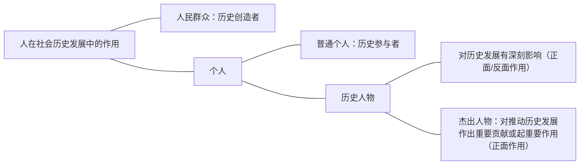

# 一、人民群众是历史的创造者
## （一）两种历史观在历史创造者问题上的对立%%重要%%
- 唯物史观与唯心史观的对立，在历史创造者问题上表现为群众史观与英雄史观的对立。
	1. 英雄史观。唯心史观从社会意识决定社会存在的基本前提出发，否认物质资料生产方式是社会发展的决定力量，抹杀人民群众的历史作用，宣扬少数英雄人物创造历史，这样的观点被称为英雄史观。英雄史观的产生有其深刻的认识根源、社会历史根源和阶级根源。
	2. 群众史观。与唯心史观相反，唯物史观主张，人民群众创造历史。之所以得出这样的结论，是因为有着深刻的理论依据，体现了唯物史观在考察历史创造者问题上的方法论原则。
## （二）唯物史观考察历史创造者的原则%%重要%%
### 1．唯物史观立足于现实的人及其本质来把握历史的创造者。
历史当然是人创造的，不能脱离人去探索历史的创造者。但唯物史观认为，人不是抽象的而是现实的，现实的人及其活动是社会历史存在和发展的前提。所谓现实的人，是基于自身需要和社会需要而从事一定实践活动的、处于一定社会关系中的、具有能动性的人。

马克思指出：“人的本质不是单个人所固有的抽象物，在其现实性上，它是一切社会关系的总和。”这就告诉我们，人的本质属性是社会属性，而不是自然属性；人的本质属性表现在各种社会关系中；人的本质是变化、发展的，而不是永恒不变的。

>**拓展与点拨**
人的本质不是单个人天生就具有的东西，也不是从所有个体的人身上抽象出来的共同性。现实的人总是处在特定历史条件和特定的社会关系特别是经济关系中。不同社会关系的人具有不同的本质，这是人的本质的根本内容。因此，人的本质是具体的、变化的、发展的。
### 2．唯物史观立足于整体的社会历史过程来探究谁是历史的创造者。
社会历史发展过程虽然离不开个体的人的活动，但整体的社会历史并非个体的历史的简单堆砌。历史是无数个追求着自己目的的人的活动的合力，就每一个人而言，他在一定意义上“创造”了自身个体的“历史”，但这并不能与创造社会历史画等号。社会历史就其整体而言，是一定的群体（集体、阶级、民族乃至全人类）的认识活动和实践活动及其产物的演进过程，是以一定的物质生产方式为基础的社会形成和演进过程。
### 3．唯物史观从社会历史发展的必然性入手来考察和说明谁是历史的创造者。
社会历史的变化发展是社会领域中各种力量交互作用的结果。在这些纵横交错的力量中，既存在着符合社会历史必然性、推动和促进社会历史向前发展的力量，也存在着违反社会历史必然性、阻碍历史前进的力量，只有代表前一种力量的人才属于历史创造者之列。
### 4．唯物史观从人与历史关系的不同层次上考察谁是历史的创造者。
人与历史的关系具有人类与历史、群体与历史、个体与历史三层关系。当我们把人类总体当作历史主体来理解的时候，无疑应该肯定总体的人在总体的历史过程中的主体地位。正是在这个意义上，马克思主义经典作家提出了“人们自己创造自己的历史”的观点，并借此同神创造历史、观念创造历史和超人创造历史等唯心史观划清界限。这就是说，社会历史的创造者不在社会外部而在社会内部。但是，唯物史观并没有停留在一般地承认“人”创造历史这一点上，而是更深入地考察群体与个体的历史作用，区分了创造历史过程中的决定力量与非决定力量、主导力量与非主导力量，从而科学地解决了谁是历史创造者的问题。

>**拓展与点拨**
>1. 历史的创造者当然是历史的参与者，但历史的参与者井不一定就是历史的创造者。
>2. “人们自己创造自己的历史”不是“人人创造历史”。因为在“人人”中，既有推动和促进社会历史向前发展的力量，也有阻碍历史前进的力量，只有代表前一种力量的人才属于历史的创造者，其他人至多只能算是历史的参与者。
## （三）人民群众在创造历史过程中的决定作用%%高频%%%%重要%%
1. 人民群众的含义。人民群众是一个历史范畴。人民群众从质上说是指一切对社会历史发展起推动作用的人们，从量上说是指社会人口中的绝大多数。在不同的历史时期，人民群众有着不同的内容，包含着不同的阶级、阶层和集团。人民群众中最稳定的主体部分始终是从事物质资料生产的劳动群众。在当代中国，全体社会主义劳动者、社会主义事业的建设者、拥护社会主义的爱国者、拥护祖国统一和致力于中华民族伟大复兴的爱国者都属于人民群众的范畴。
2. 人民群众在创造历史过程中的决定作用。在社会历史发展过程中，人民群众起着决定性的作用。人民群众是社会历史实践的主体，是历史的创造者。
	1. 第一，人民群众是社会物质财富的创造者。
	2. 第二，人民群众是社会精神财富的创造者。
	3. 第三，人民群众是社会变革的决定力量。人民群众创造历史的作用是同社会基本矛盾运动推动社会前进的过程相一致的。人民群众的总体意愿和行动代表了历史发展的方向，人民群众的社会实践最终决定历史发展的结局。
3. 人民群众创造历史的活动要受到一定社会历史条件的制约。人们自己创造自己的历史，但不是随心所欲地创造。经济条件对于人民群众创造历史的活动有着首要的、决定性的影响。

>**经典真题**
6.（2018年单选第3题）坚持以人民为中心，就必须坚持人民主体地位，坚持立党为公、执政为民，践行全心全意为人民服务的根本宗旨，把党的群众路线贯彻到治国理政全部活动之中，把人民对美好生活的向往作为奋斗目标。“坚持以人民为中心”的理论基础是唯物史观关于
A.人的本质是一切社会关系的总和的原理
==B.人民群众是历史的创造者的原理√==
C.人民群众的活动受到社会历史条件制约的原理
D.总体的人在总体的历史过程中的主体地位的原理
## （四）无产阶级政党的群众路线
- 唯物史观关于人民群众是历史创造者的原理，是无产阶级政党的群众观点和群众路线的理论基础。
	1. 马克思主义群众观点的主要内容：坚信人民群众自己解放自己的观点，全心全意为人民服务的观点，一切向人民群众负责的观点，以及虚心向群众学习的观点。
	2. 群众路线。群众路线是群众观点在实际工作中的贯彻运用。其基本内容是：一切为了群众，一切依靠群众，从群众中来，到群众中去。群众路线是我们党的生命线和根本工作路线，是党的优良传统，是党在革命、建设、改革时期不断取得胜利的重要法宝。
# 二、个人在社会历史中的作用%%高频%%
唯物史观主张人民群众是历史的创造者，但不否认个人在历史上的作用。

## （一）杰出人物的历史作用%%重要%%
### 1．唯物史观主张在考察个人的历史作用时，要具体分析个人及其作用的性质、大小
按照个人对社会历史起作用的程度和方式的不同，可以区分为普通个人和历史人物。有的人的作用小些，可称为“普通个人”，他们对社会发展贡献的总和构成了人民群众创造历史的活动；有的人的作用大些，可称为“历史人物”。历史人物是一定历史事件的主要倡导者、组织领导者或思想理论、科学文化的重要代表人物。历史人物对历史发展有深刻影响，甚至有时能够决定个别历史事件的结局，从而导致历史发生这样或那样的重大变化。按其发挥作用的性质，历史人物有些起推动历史前进的进步作用，有些起阻碍历史前进的反动作用。
### 2．杰出人物在历史的发展过程中起着特殊的作用
杰出人物是历史人物中对推动历史发展作出重要贡献或起重要作用的人。在历史发展进程中，新的历史任务往往是由具有进步意义的历史人物首先发现或提出来的。但是，历史人物不管在历史上发挥什么样的作用，都要受到社会发展客观规律的制约，而不能决定和改变历史发展的总进程和总方向。

>**经典真题**
7.（2017年多选第18题）唯物史观在坚持人民群众是历史的创造者这一基本前提下，高度重视个人在历史上的作用。历史人物是一定历史事件的主要倡导者、组织领导者或思想理论、科学文化的重要代表人物。下列关于历史人物历史作用的正确认识是
==A.历史人物不论发挥什么样的作用都不能决定和改变历史发展的总进程和总方向√==
==B.历史人物会因其智慧、性格等因素对社会进程发生影响√==
==C.具有进步意义的历史人物往往能够首先发现或提出历史进程中新的历史任务√==
D.历史人物对历史发展的作用都是积极的
## （二）辩证地理解和评价个人的历史作用
### 1．任何历史人物的出现都体现了必然性与偶然性的统一
时势造英雄，杰出人物的出现具有必然性。杰出人物会因其智慧、性格因素对社会进程产生影响，但这些作用仅仅是历史进程中的偶然现象，只能成为社会发展的个别原因。
### 2．评价历史人物的科学方法
1. 历史分析方法。历史分析方法要求从特定的历史背景出发，根据当时的历史条件，对历史人物的是非功过进行具体的、全面的考察。
2. 阶级分析方法。在阶级社会中，贯彻历史分析方法与坚持阶级分析方法是一致的。阶级分析方法要求把历史人物置于一定的阶级关系中，同他所属的阶级联系起来加以考察和评价。
## （三）群众、阶级、政党、领袖的关系
群众、阶级、政党、领袖是一个有机整体：群众是划分为阶级的；阶级通常是由政党领导的；政党是由领袖来主持的。