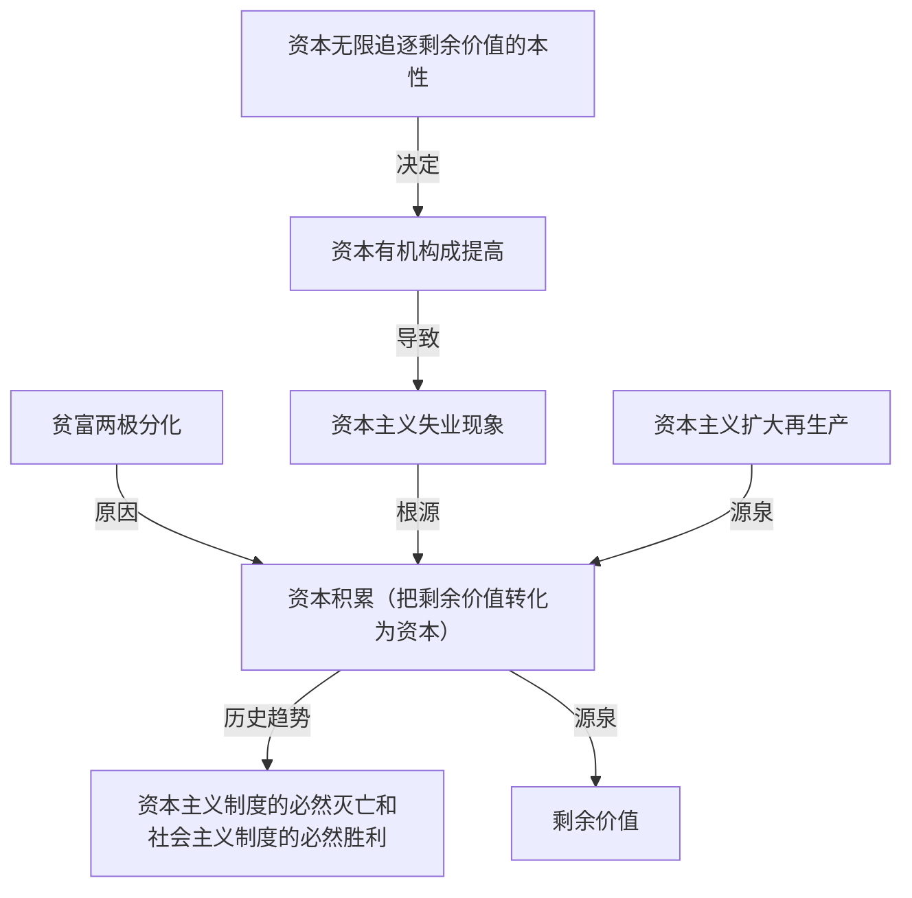

# 一、资本主义经济制度的产生
## （一）前资本主义社会形态的演进和更替
原始社会是人类社会发展中的第一个社会形态。奴隶社会是人类历史上第一个阶级剥削社会。封建社会的生产关系以封建主占有土地等生产资料和不完全占有农民（农奴）为基本特征。
## （二）资本主义生产关系的产生
资本主义萌芽于14世纪末15世纪初地中海沿岸的一些城市，其途径有两个：一是从小商品经济分化出来；二是从商人和高利贷者转化而来。
## （三）资本的原始积累
1. 资本原始积累的内涵。所谓资本原始积累，就是以暴力手段使生产者与生产资料相分离，货币资本迅速集中于少数人手中的历史过程。在西欧，资本原始积累开始于15世纪后30年，经过16世纪的高潮，一直延续到19世纪初才告结束。
2. 资本原始积累的途径主要有两个：
	1. 一是用暴力手段剥夺农民的土地（这是资本原始积累过程的基础）；
	2. 二是用暴力手段掠夺货币财富。资本原始积累的事实表明，资产阶级的发家史就是一部罪恶的掠夺史。

>**经典真题**
5.（2017年多选第19题）马克思指出，所谓资本原始积累“只不过是生产者和生产资料分离的历史过程。这个过程所以表现为“原始的”，因为它形成资本及与之相适应的生产方式的前史”。资本原始积累的主要途径有
A.用资本手段获取市场暴利
B.用剥削手段榨取剩余价值
==C.用野蛮手段进行殖民掠夺√==
==D.用暴力手段剥夺农民土地√==
## （四）资本主义制度的确立
从17世纪中期到18世纪后期，英、法等国先后进行了资产阶级革命，建立了资产阶级的政治统治，实现了产业革命，机器大工业代替了工场手工业，资本主义生产方式的支配地位得以形成。资产阶级政治统治的建立和资本主义生产方式支配地位的形成，标志着资本主义制度的最终确立。
# 二、劳动力成为商品与货币转化为资本
资本主义经济制度是以资本主义私有制和雇佣劳动为基础的一种剥削制度。这一经济制度的形成是以劳动力成为商品为前提条件的。

在资本总公式“G—W—G＇”中，W代表商品，G代表的不是一般意义上的货币，而是作为资本的货币，G＇代表的是价值增殖后的货币。从形式上看，资本总公式与商品交换的原则是矛盾的。价值规律要求商品交换遵循等价交换原则，交换领域不能创造新价值，但资本总公式却表明，资本在流通中创造了新价值。如何理解这个矛盾呢？问题的关键在于劳动力成为商品。
## （一）劳动力成为商品的基本条件
1. 劳动力是指人的劳动能力，是人的体力和脑力的总和。劳动力的使用即劳动。 ^jyweap
2. 劳动力成为商品，要具备两个基本条件：
	- 第一，劳动者是自由人，能够把自己的劳动力当作自己的商品来支配；
	- 第二，劳动者没有别的商品可以出卖，没有任何实现自己的劳动力价值所必需的物质条件。
1. 劳动力成为商品，标志着简单商品生产发展到资本主义商品生产的新阶段。在这一阶段，资本家与工人的关系，形式上是“自由”“平等”的买卖关系，而实质上是资本主义的雇佣劳动的关系。 ^gebifu
## （二）劳动力商品的特点与货币转化为资本%%高频%%%%重要%%
- 像任何商品一样，劳动力商品也具有价值和使用价值。但是，劳动力是特殊的商品，它的价值和使用价值具有不同于普通商品的特点。 ^3pbgit
	1. 劳动力商品的价值，是由生产、发展、维持和延续劳动力所必需的生活必需品的价值决定的。它包括三个部分： ^6rn5uw
		1. 维持劳动者本人生存所必需的生活资料的价值；
		2. 维持劳动者家属的生存所必需的生活资料的价值；
		3. 劳动者接受教育和训练所支出的费用。由于劳动力价值的构成包含着一个历史的和道德的因素，在不同的国家或在同一国家的不同历史时期，劳动者所必需的生活资料的数量和构成也是有区别的，所以劳动力价值的最低界限，是由生活上不可缺少的生活资料的价值决定的。一旦劳动力价值降低到这个界限以下，劳动力就只能在萎缩的状态下维持。 ^8u1geh
	2. 劳动力商品在使用价值上有一个很大的特点，就是它的使用价值是价值的源泉，它在消费过程中能够创造新的价值，而且这个新的价值比劳动力本身的价值更大。正是由于这一特点，货币所有者购买到劳动力以后，在消费它的过程中，不仅能够收回他在购买这种商品时支付的价值，还能得到一个增殖的价值即剩余价值。而一旦货币购买的劳动力带来剩余价值，货币也就变成了资本。 ^b4ak14
	3. 在资本主义条件下，资本家购买的是雇佣工人的劳动力而不是劳动。劳动是劳动力商品的使用价值，它本身并不是商品。劳动力商品具有能创造比自身价值大的价值的特点，正因为如此，资本家才购买劳动力来进行资本主义生产。

>**拓展与点拨** 
>1. 劳动力商品首先是商品，具有商品的一般属性，如都具有商品的二因素，价值规律都起作用等。
>2. 劳动力这种特殊商品的使用价值就是劳动（劳动力的使用即劳动），而劳动是价值的（唯一）源泉，因此才有“它的使用价值是价值的源泉”的说法。
^19jlxf

>**经典真题**
6.（2010年单选第4题）劳动力成为商品是货币转化为资本的前提条件，这是因为
A.资本家购买的是劳动力的价值
B.劳动力商品具有价值和使用价值
==C.货币所有者购买的劳动力能够带来剩余价值√==
D.劳动力自身的价值能够在消费过程中转移到新的商品中去
# 三、资本主义所有制
资本家之所以能够购买工人的劳动力，把工人变成雇佣工人，其根源在于资本主义的生产资料所有制。
## （一）所有制和所有权
1. 经济意义上的所有制。经济意义上的所有制是指事实上生产资料归谁所有、归谁支配，并凭借这种所有和支配实现生产和获得剩余产品（利润或[[资本主义经济制度的本质#（七）超额剩余价值%%重要%%|超额利润]]）。
2. 法律意义上的所有制。法律意义上的所有制是由占有生产资料的法律原则决定的。当所有制关系上升至法的关系的高度，所有制的现实经济形态就具有了法律形态，即所有权范畴。
3. 所有制与所有权的关系。所有制是所有权的基础，所有制决定着所有权，所有权是所有制的法律形态，它反映着经济关系的意志关系。这种意志关系或者法的关系的性质在根本上是由这种经济关系本身决定的。
## （二）资本主义所有制的本质%%重要%%
与以往的剥削制度不同，资本家与工人的关系不是完全占有（奴隶主完全占有奴隶的人身），也不是人身依附（农民对地主的人身依附），而是基于劳动者的完全的人身自由。资本家只能通过购买劳动力的方式，将出卖了劳动力的劳动者与生产资料结合在一起进行生产并取得剩余价值。在这里，生产资料和货币采取了资本的形式，生产资料的所有者成为资本人格化的资本家，资本家与劳动者之间的关系是资本雇佣劳动的关系。资本家凭借对生产资料的占有，在等价交换原则的掩盖下，雇佣工人从事劳动，无偿占有雇佣工人创造的剩余价值，这就是资本主义所有制的本质。
# 四、生产剩余价值是资本主义生产方式的绝对规律
资本主义生产的直接目的和决定性动机，就是无休止地采取各种方法获取尽可能多的剩余价值。这种不以人的意志为转移的客观必然性就是剩余价值规律。
## （一）资本主义生产过程的两重性%%重要%%
- 资本主义的生产过程具有两重性，一方面是物质资料的生产过程，另一方面是剩余价值的生产过程，即价值增殖过程。资本主义生产过程是劳动过程和价值增殖过程的统一。
	1. 资本主义劳动过程是生产使用价值的过程。由于资本主义劳动过程的要素都被资本家所占有，由此决定了资本主义劳动过程的两个特点：其一，工人在资本家的监督下劳动，他们的劳动隶属于资本家；其二，劳动的成果或者产品全部归资本家所有。 ^kl351q
	2. 价值增殖过程是剩余价值的生产过程，这是资本主义生产过程的主要方面。所谓价值增殖过程，是超过劳动力价值的补偿这个一定点而延长了的价值形成过程。如果劳动者创造的价值刚好补偿资本家所预付的劳动力价值，那就是单纯的价值形成过程；如果价值形成过程超过了这个一定点，就变成了价值增殖过程。
## （二）剩余价值的实质%%重要%%
在价值增殖过程中，雇佣工人的劳动分为两部分：一部分是必要劳动，用于再生产劳动力的价值；另一部分是剩余劳动，用于无偿地为资本家生产剩余价值。资本家购买的劳动力，在生产过程中创造了超过补偿劳动力的价值，从而形成了剩余价值，这是价值形成过程转变为价值增殖过程的关键。因此，剩余价值是雇佣工人所创造的并被资本家无偿占有的超过劳动力价值的那部分价值，它是雇佣工人剩余劳动的凝结，体现了资本家与雇佣工人之间剥削与被剥削的关系。
## （三）资本的本质%%重要%%
[[资本主义经济制度的本质#^b4ak14|资本]]是可以带来剩余价值的价值。剩余价值是由雇佣工人的剩余劳动创造的。在资本主义社会里，资本总是通过各种物品表现出来的，但资本的本质不是物，而是一定的历史社会形态下的[[人类社会的存在与发展#2．生产关系|生产关系]]。
## （四）不变资本和可变资本的区分及其意义%%重要%%
- 资本在资本主义生产过程中采取[[人类社会的存在与发展#^dc8v64|生产资料]]和[[资本主义经济制度的本质#^jyweap|劳动力]]两种形态，根据这两部分资本在剩余价值生产中所起的不同作用，可以将资本区分为不变资本与可变资本。
	1. 不变资本。不变资本是以[[人类社会的存在与发展#^dc8v64|生产资料]]形态存在的资本。生产资料的价值通过工人的具体劳动被转移到新产品中，其转移的价值量不会大于它原有的价值量。尽管不同形式的生产资料转移价值的形式有所不同，有的是在一次生产过程中全部转移，如原材料和燃料（流动资本）；有的是在多次生产过程中逐渐转移，如机器、厂房等（固定资本），但是转移的总是生产资料原有的价值量。以生产资料形式存在的资本在生产过程中只转变自己的物质形态而不改变自己的价值量，不发生增殖，所以马克思把这部分资本叫作不变资本（c）。 ^930ttc
	2. 可变资本。可变资本是用来购买[[资本主义经济制度的本质#^jyweap|劳动力]]的那部分资本。可变资本的价值在生产过程中不是被转移到新产品中去的，而是由工人的劳动再生产出来的。再生产过程中，工人所创造的新价值，不仅包括相当于劳动力价值的价值，而且还包括一定量的剩余价值。由于这一部分资本价值不是不变的，而是一个可变的量，所以马克思把这一部分资本叫作可变资本（v）。 ^k3lpgy
	3. 区分的意义。把资本区分为[[资本主义经济制度的本质#^930ttc|不变资本]]和[[资本主义经济制度的本质#^k3lpgy|可变资本]]，进一步揭示了剩余价值产生的源泉。它表明，剩余价值既不是由全部资本创造的，也不是由不变资本创造的，而是由可变资本创造的。雇佣劳动者的剩余劳动是剩余价值产生的唯一源泉。这种划分也为确定资本家对雇佣劳动者的剥削程度提供了科学依据。 ^q5egwr

||五组劳动划分总结|
|:---:|:---:|
|具体劳动和抽象劳动|[[商品经济和价值规律#四、生产商品的劳动二重性\|劳动的二重性]]，决定了[[商品经济和价值规律#三、商品的二因素\|商品的二因素]]|
|个别劳动和社会必要劳动|决定商品价值量的是社会必要劳动时间|
|简单劳动和复杂劳动|商品价值量是以简单劳动为尺度计量的，复杂劳动等于自乘的或多倍的简单劳动|
|私人劳动和社会劳动|私人劳动转化为社会劳动（商品卖出去），商品的价值才得到了实现 交换是解决私人劳动和社会劳动之间矛盾的唯一途径|
|必要劳动和剩余劳动|必要劳动用于再生产劳动力的价值，剩余劳动无偿地为资本家生产剩余价值|^ihz3ct
## （五）剩余价值率%%重要%%
剩余价值率是[[资本主义经济制度的本质#（二）剩余价值的实质%%重要%%|剩余价值]]与[[资本主义经济制度的本质#^k3lpgy|可变资本]]的比率。既然剩余价值不是由全部资本创造的，而仅仅是由[[资本主义经济制度的本质#^k3lpgy|可变资本]]创造的，因此，要确定资本家对工人的剥削程度，就应该拿剩余价值和可变资本相比，而不应该把它去同全部资本相比。用公式表示：m＇＝m／v。在该公式中，m＇为剩余价值率，m为剩余价值，v为可变资本。剩余价值率还可以表示为：m＇＝剩余劳动／必要劳动＝剩余劳动时间／必要劳动时间。

>**拓展与点拨** 
记忆方法：
c＝constant capital＝[[资本主义经济制度的本质#^930ttc|不变资本]]
v＝variable capital＝[[资本主义经济制度的本质#^k3lpgy|可变资本]]
m＝Mehrwert（德语）＝[[资本主义经济制度的本质#（二）剩余价值的实质%%重要%%|剩余价值]]

>**经典真题**
7.（2016年单选第3题）某资本家投资100万元创办企业从事生产，60万元用于固定资本、以购买机器设备等，40万元用于流动资本、以购买原材料和劳动力等（其中购买劳动力支付了10万元）。—轮生产结束后，该企业的总资本达到了120万元。那么，该企业的剩余价值率为
==A.200%√==
B.50%
C.100%
D.20%
## （六）绝对剩余价值和相对剩余价值%%高频%%
- 资本家提高对工人的剥削程度的方法是多种多样的，最基本的方法有两种，即绝对剩余价值的生产和相对剩余价值的生产。
	1. 绝对剩余价值。绝对剩余价值是指在必要劳动时间不变的条件下，由于延长工作日的长度而生产的剩余价值。在必要劳动时间既定的条件下，工作日越长，剩余劳动时间越长，从而剩余价值率就越高。除了使用延长劳动时间的方法以外，资本家还使用提高工人劳动强度的方法，让他们在同样长的劳动时间内比以前消耗更多的脑力和体力，这和延长工作日并没有本质的区别，也是绝对剩余价值生产方法。 ^8ezbfr
	2. 相对剩余价值。相对剩余价值是指在工作日长度不变的条件下，通过缩短必要劳动时间而相对延长剩余劳动时间生产的剩余价值。缩短必要劳动时间是通过全社会劳动生产率的提高实现的。由于社会劳动生产率的提高，降低了劳动力的价值，从而缩短了必要劳动时间，相对延长了剩余劳动时间。全社会劳动生产率的提高是资本家追逐[[资本主义经济制度的本质#（七）超额剩余价值%%重要%%|超额剩余价值]]的结果。 ^cavi6c

>**拓展与点拨**
绝对剩余价值生产和相对剩余价值生产虽然采取的具体做法不同，但都延长了剩余劳动时间，增加了资本家无偿占有的剩余价值量。在资本主义发展的初期，资本家主要依靠绝对剩余价值生产来提高剥削程度。随着生产技术条件的不断改进和工人阶级反抗资本家延长工作日的斗争力量的增强，相对剩余价值生产的作用就日益突出了。
## （七）超额剩余价值%%重要%%
超额剩余价值是指企业由于提高[[商品经济和价值规律#（二）商品的价值量与劳动生产率的关系%%高频%%|劳动生产率]]而使商品的个别价值低于社会价值的差额。在资本主义商品生产条件下，每个资本家总是力图不断改进技术，改善经营管理，提高[[商品经济和价值规律#（二）商品的价值量与劳动生产率的关系%%高频%%|劳动生产率]]，使其生产的商品的个别劳动时间少于[[商品经济和价值规律#（一）社会必要劳动时间决定商品的价值量%%重要%%|社会必要劳动时间]]，个别价值低于社会价值，从而获得超额剩余价值。

在资本主义商品生产条件下，单个资本家改进技术、改善管理的主观动机是追求超额剩余价值，但其客观后果则是整个社会各个生产部门的劳动生产率普遍提高，导致生活资料的价值下降和补偿劳动力价值的必要劳动时间缩短，而剩余劳动时间相对延长，整个资本家阶级普遍获得[[资本主义经济制度的本质#^cavi6c|相对剩余价值]]。
## （八）生产自动化条件下剩余价值的源泉
第二次世界大战以后，资本主义国家经历了第三次科学技术革命，机器大工业发展到自动化阶段。资产阶级经济学家根据这些情况，指出技术和科学“成为独立的剩余价值源泉”，马克思的剩余价值学说已不适用于现代资本主义了。这种观点是错误的。

资本主义条件下的生产自动化只是意味着剩余价值生产所使用的生产工具更加先进了，不论是机器人、自动化生产线，还是“无人工厂”，它们在本质上依然是物化劳动或不变资本的实物形式。它们的价值是在工人生产它们的过程中形成的，在它们参加产品的生产时，只是把原有的价值转移到产品中去，而不创造新价值，更不能创造剩余价值。资本主义条件下的生产自动化是资本家获取高额剩余价值的手段，而雇佣工人的剩余劳动仍然是这种剩余价值的唯一源泉。

资本主义生产方式的根本目的是追求剩余价值，但客观上也会促进生产力的发展和社会进步。

>**经典真题**
8.（2022年多选第21题）马克思、恩格斯在《共产党宣言》中指出：“资产阶级在它的不到一百年的阶级统治中所创造的生产力，比过去一切世代创造的全部生产力还要多，还要大。自然力的征服，机器的采用，化学在工业和农业中的应用，轮船的行驶，铁路的通行，电报的使用，整个整个大陆的开垦，河川的通航，仿佛用法术从地下呼唤出来的大量人口——过去哪一个世纪料想到在社会劳动里蕴藏有这样的生产力呢？”资本主义社会生产力迅速发展的主要原因是
==A.资本追逐剩余价值的内在动力√==
==B.市场激烈竞争的外在压力√==
C.无产阶级反对资产阶级的斗争
D.资本主义国家对市场的全面控制
# 五、资本积累
把剩余价值转化为资本，或者说，剩余价值的资本化，就是资本积累。马克思关于资本积累的学说是剩余价值理论的重要组成部分，它揭露了资本主义制度下贫富两极分化的原因，揭示了资本主义失业现象的本质，深刻地阐明了资本主义制度必然走向灭亡的历史命运。 ^diy61x
## （一）资本主义简单再生产和扩大再生产（形式、实质和特点）%%重要%%
资本家瓜分到剩余价值后，如果将其完全用于个人消费，则生产就在原有规模的基础上重复进行，这叫资本主义简单再生产。资本主义简单再生产，不仅生产商品，生产剩余价值，而且还生产和再生产资本主义生产关系本身：一方面是资本家，另一方面是雇佣工人。因此，资本主义简单再生产，就其实质而言，是物质资料再生产和资本主义生产关系再生产的统一。

但是，资本主义再生产的特点是扩大再生产。资本家获得无偿占有的剩余价值后，并不是将其完全用于个人消费，而是将一部分转化为资本，用以购买追加的生产资料和劳动力，使生产在扩大的规模上重复进行，这就是资本主义的扩大再生产。在这里，资本积累是资本主义扩大再生产的源泉。
## （二）资本积累的本质、源泉和后果%%重要%%
1. 本质。资本积累的本质，就是资本家不断地利用无偿占有的工人创造的剩余价值来扩大自己的资本规模，进一步扩大和加强对工人的剥削和统治。
2. 源泉。资本积累的源泉是剩余价值，资本积累规模的大小取决于资本家对工人的剥削程度（同方向变化）、劳动生产率的高低（同方向变化）、所用资本和所费资本之间的差额（同方向变化）以及资本家垫付资本的大小（同方向变化）。 ^pq4r97
3. 后果。随着资本积累和生产规模的扩大，社会财富日益集中到资产阶级手中，而社会财富的直接创造者—无产阶级则只占有少部分社会财富。随着资本积累，必然加剧社会的两极分化，即一极是财富越来越集中于少数人手中，另一极是多数人只拥有社会财富的较小部分。资本积累不但是社会财富占有两极分化的重要原因，而且是资本主义社会失业现象产生的根源。

>**拓展与点拨**
>1. 抽象劳动是价值的唯一源泉；具体劳动是使用价值的源泉，但不是唯一源泉。
>2. 劳动力商品的使用价值（即劳动）是价值的源泉。
>3. 雇佣劳动者的剩余劳动是剩余价值产生的唯一源泉。
>4. 资本积累是资本主义扩大再生产的源泉。
>5. 剩余价值是资本积累的源泉。
^axd9on

>**经典真題**
9．（2018年多选第19题）为了追逐最大化的利润，资本家总是想方设法地进行资本积累，而资本积累的源泉是剩余价值。一般而言，资本积累规模的大小取决于
==A.资本家对工人的剥削程度√==
==B.劳动生产率的高低√==
==C.资本家垫付资本的大小√==
==D.所用资本与所费资本之间的差额√==
## （三）资本有机构成%%重要%%
随着资本积累而产生的失业是由资本主义追逐剩余价值引起资本有机构成的提高所导致的。在资本主义企业内部，资本家投入到资本主义生产过程中的资本，从自然形式上看，总是由一定数量的生产资料和劳动力构成的。在生产资料和劳动力之间，存在着一定比例，这个比例取决于生产技术的发展水平。生产技术水平愈高，每个劳动力所推动的生产资料的数量就愈多；生产技术水平愈低，每个劳动力所推动的生产资料的数量也就愈少。这种由生产的技术水平所决定的生产资料和劳动力之间的比例，叫作资本的技术构成。从价值形式上看，资本可分为不变资本和可变资本，这两部分资本价值之间的比例，叫作资本的价值构成。在资本的技术构成和资本的价值构成之间，存在着密切的联系。一般来说，资本的技术构成决定资本的价值构成，技术构成的变化往往会引起价值构成的相应变化，而价值构成的变化通常反映着技术构成的变化。这种由资本的技术构成决定并反映技术构成变化的资本价值构成%%言外之意是技术构成还可以由生产资料和劳动力的价格变化而改变%%，叫作资本的有机构成，通常用c:v来表示，其中c为不变资本，v为可变资本。

>**拓展与点拨**
由于原材料价格上涨使资本构成发生了变化，所变化的资本构成是资本价值构成，不是资本有机构成。

>**经典真题**
10.（2021年多选第20题）某服装厂为了实现更高的盈利，将原本依靠人工进行生产的流水线改造成了完全依靠机器进行生产的流水线。与此同时，由于受经济危机的影响，该服装厂从市场上采购的布料等生产原料价格也出现了大幅度的下降。在这种情况下，该服装厂资本构成会发生变化的是
==A.资本有机构成√==
B.资本积累构成
==C.资本技术构成√==
==D.资本价值构成√==
## （四）相对过剩人口%%重要%%
在资本主义生产过程中，资本有机构成的提高是一般趋势，这是由资本无限追逐剩余价值的本性决定的。资本家通过资本积聚和资本集中扩大生产规模，使资本有机构成不断提高。在资本有机构成提高的情况下，由于可变资本相对量的减少，资本对劳动力的需求日益相对地减少，其结果，就不可避免地造成大批工人失业，形成相对过剩人口。所谓相对过剩人口，就是劳动力供给超过了资本对它的需要。这种过剩人口之所以是相对的，是因为它并不是社会生产发展所绝对不需要的，而是由于他们不为资本价值增殖所需要，使他们成为“过剩”的或“多余”的人了。相对过剩人口基本上有三种形式：一是流动的过剩人口，二是潜在的过剩人口，三是停滞的过剩人口。经常性的庞大失业人口的存在，是资本主义的痼疾。资产阶级政府通过各种干预措施可能在一定程度上缓解失业，但是不可能彻底消灭失业。

^nx4kyj

## （五）资本积累的历史趋势
资本积累的历史趋势是资本主义制度的必然灭亡和社会主义制度的必然胜利。随着资本积累的增长，一方面，资本主义生产愈来愈具有社会性，生产的范围从一个企业扩展到一个国家，甚至扩展到全球，整个社会的经济活动密切地联结成一个整体。另一方面，资本愈来愈集中于少数资本家手中，生产完全服从于资本家追逐剩余价值的目的。这样，在生产的社会性和资本主义的私人占有形式之间便发生了深刻的矛盾。随着资本积累的不断增长，这一矛盾日益加剧，这是资本主义被新的、更能够适应社会化大生产要求的社会形态所取代的根本原因。
# 六、资本的循环周转与再生产
## （一）资本循环及其职能形式
1. 资本作为一种自行增殖的价值，不仅在生产过程内运动，而且也在流通过程内运动。马克思在分析资本主义流通过程中，首先详尽地分析了个别资本的运动，即资本的循环和周转过程，揭示了资本循环周转规律。
2. 产业资本循环的三个阶段和采取的三种职能形式。 ^3oyl2q
	- 资本循环是资本从一种形式出发，经过一系列形式的变化，又回到原来出发点的运动。产业资本在循环过程中要经历三个不同的阶段，与此相联系的是资本依次执行三种不同的职能。
		- 第一个阶段是购买阶段，即生产资料与劳动力的购买阶段，产业资本执行的是货币资本的职能。
		- 第二个阶段是生产阶段，即生产资料与劳动力按比例结合在一起从事资本主义生产的阶段，产业资本执行的是生产资本的职能。
		- 第三个阶段是售卖阶段，即商品资本向货币资本的转化阶段，产业资本执行的是商品资本的职能。

**马克思对资本家垫付资本的划分**

|划分依据|划分结果|
|:---:|:---:|
|资本在生产中是否增殖|不变资本、可变资本|
|资本在循环中执行的不同职能|货币资本、生产资本、商品资本|
|资本价值的周转方式|固定资本、流动资本|^mi7fx1
 
>**经典真題**
11.（2020年多选第20题）资本循环是资本实现价值增殖的重要前提。所谓资本循环，是指资本从一种形式出发，经过一系列形式的变化，又回到原来出发点的运动。产业资本循环过程中在空间上同时存在的资本形式有
==A.货币资本√==
B.借贷资本
==C.生产资本√==
==D.商品资本√==
## （二）产业资本运动的基本前提条件%%重要%%
- 产业资本循环顺利进行有两个基本前提条件：
	- 一是产业资本的三种职能形式必须在空间上并存，也就是说，产业资本必须按照一定比例同时并存于货币资本、生产资本和商品资本三种形式中。
	- 二是产业资本的三种职能形式必须在时间上继起，也就是说，产业资本循环的三种职能形式必须保持时间上的依次连续性。
	- 产业资本的连续循环，是流通过程和生产过程的统一，也是它的所有三种循环形式的统一。
## （三）资本周转及其速度
1. 资本周转。资本是在运动中增殖的，资本必须不断地、周而复始地循环，才能不断地带来剩余价值。这种周而复始、不断反复着的资本循环，就叫作资本的周转。
2. 资本周转速度。如果每次资本周转带来的剩余价值一定，则资本周转越快，在一定时期内带来的剩余价值就越多。影响资本周转快慢的关键因素有两个，一是资本周转时间（资本周转速度与资本周转时间成反比）；二是生产资本中固定资本和流动资本的构成（固定资本占的比重大，整个资本周转速度就慢；相反，流动资本占的比重大，整个资本周转速度就快）。 ^kotasg
## （四）社会再生产的核心问题及实现条件%%重要 %%
### 1.社会再生产的核心问题
社会生产是连续不断进行的，这种连续不断重复的生产就是再生产。社会再生产的核心问题是社会总产品的实现问题，即社会总产品的价值补偿和实物补偿问题。
### 2.社会再生产的实现条件
1. 分析社会再生产的两个基本理论前提。马克思将社会总产品在物质上划分为两大部类，在价值上划分为三个组成部分。所谓社会总产品就是社会在一定时期（通常为一年）所生产的全部物质资料的总和。社会总产品在价值形态上又叫社会总价值，它划分为包括在产品中的生产资料的转移价值（c）和凝结在产品中的由工人必要劳动创造的价值（v），以及凝结在产品中的由工人在剩余劳动时间里创造的价值（m）。社会总产品在物质形态上可以划分为两大部类，第一部类（I）由生产生产资料的部门所构成，其产品进入生产领域；第二部类（II）由生产消费资料的部门所构成，其产品进入生活消费领域。
2. 社会再生产的实现条件。社会再生产要顺利进行，要求生产中所耗费的资本在价值上得到补偿，同时要求实际生产过程中所耗费的生产资料和消费资料得到实物的替换，这在客观上就要求两大部类内部各个产业部门之间和两大部类之间保持一定的比例关系。生产资料的生产既要满足本部类对消耗掉的生产资料的补偿，也要保证两大部类扩大生产规模后对追加生产资料的需求。消费资料的生产则既要满足两大部类劳动者的个人消费和社会消费，也要满足扩大生产规模后对追加消费资料的需求。只有两大部类的生产不仅在规模上，而且在结构上保持一定的比例，社会总产品的价值补偿和实物替换才能正常实现，社会再生产才能顺利进行。 ^72gr2z
3. 经济危机实际上是以强制的方式解决社会再生产的实现问题的途径。在资本主义发展的相当长时期内，由于生产资料的私有制和雇佣劳动制度所决定，两大部类的生产都是在价值规律和剩余价值规律的作用下自发进行的，具有严重的盲目性，这就导致了两大部类生产在规模上和结构上经常处于失衡状态，最严重的就是引发经济危机。经济危机的发生，实际上是资本主义条件下以强制的方式解决社会再生产的实现问题的途径，这种解决方式虽然最终也能够使社会再生产由失衡慢慢转变为平衡，却是以社会经济生活的严重混乱和瘫痪以及社会资源和财富的极大浪费为代价的。 ^w1lfrh

>**经典真题**
12.（2014年单选第3题）社会生产是连续不断进行的，这种连续不断重复的生产就是再生产。每次经济危机发生期间，总有许多企业或因产品积压、或因订单缺乏等致使其无法继续进行再生产而被迫倒闭。那些因产品积压而倒闭的企业主要是由于无法实现其生产过程中的
A.劳动补偿
==B.价值补偿√==
C.实物补偿
D.增殖补偿
# 七、工资与剩余价值的分配
## （一）资本主义工资的本质和形式%%高频%%
1. 资本主义工资的本质。在资本主义制度下，工人的工资是劳动力的价值或价格，这是资本主义工资的本质。在这种制度下，资本家购买工人的劳动力是以货币工资形式支付的，工人为资本家劳动，资本家付给工人工资，工资表现为“劳动的价格”，或工人全部劳动的报酬。这就模糊了工人必要劳动和剩余劳动的界限，掩盖了资本主义的剥削关系。 ^j5pdb8

>**拓展与点拨**
工资表现为“劳动的价格”，这里的引号就是要说明所谓“劳动的价格”是一种假象，也正是因为这个假象才掩盖了剥削关系。真实的情况是工资是劳动力的价值或价格。
^4pia30

2. 资本主义工资的形式。主要有两种，即计时工资和计件工资。除此之外，资本家还建立了各种形式的血汗工资制度，例如19世纪末20世纪初流行的“泰罗制”和“福特制”。 ^4vp0qm
3. 在当代资本主义国家，工人的实际工资呈现不断提高的趋势，但是与工人创造的剩余价值的增长幅度相比，实际工资提高的幅度还是较小的。只要资本和雇佣劳动的基本经济关系不变，资本主义工资的本质就不会发生根本变化。 ^hc6vrf
## （二）平均利润的形成和剩余价值的分配%%重要%%
1. 
	- 剩余价值转化为利润。在现实的资本主义经济生活中，资本家并不把剩余价值看作可变资本的产物，而是把它看作全部垫付资本的产物或增加额。这样，剩余价值就取得了利润的形态。 ^48ei0u
	- 利润和剩余价值本来是同一个东西，所不同的是，剩余价值是对可变资本而言，利润是对全部垫付资本而言。剩余价值是利润的本质，利润是剩余价值的转化形式。当剩余价值转化为利润时，剩余价值与可变资本的关系便被掩盖了。  ^ib62cp ^iufy7h

>**拓展与点拨**
剩余价值率m＇＝m／v；利润率p＇＝m／（c＋v）；因此利润率总是小于剩余价值率。
^1t8plq

2. 平均利润率与剩余价值的瓜分。
	1. 。
		- 利润平均化。资本主义生产的目的是获得利润。为了得到尽可能高的利润率和尽可能多的利润，不同生产部门的资本家之间必然展开剧烈的竞争，大量资本必然从利润率低的部门转投到利润率高的部门，从而导致利润率平均化，这体现着不同部门的资本家集团按照等量资本要求等量利润的原则来瓜分剩余价值的关系。按照平均利润率来计算和获得的利润，叫作平均利润。 ^fadji2
		- 在利润平均化规律作用下，产业资本家获得产业利润，商业资本家获得商业利润，银行资本家获得银行利润，农业资本家获得农业利润。利润平均化规律，反映了在瓜分剩余价值上，资本家之间存在竞争和矛盾，但在加强对工人阶级的剥削以榨取更大量的剩余价值这一点上，资本家之间有着共同的阶级利益。  
	2. 随着利润转化为平均利润，商品价值就转化为生产价格，即生产成本加平均利润。生产成本是由生产中实际耗费的不变资本和可变资本所构成的。 ^pnszax
	3. 生产价格是商品价值的转化形式，在价值转化为生产价格的条件下，价值规律作用的形式发生了变化。商品不再以价值而是以生产价格为基础进行交换，市场价格的变动不再以价值为中心，而是以生产价格为中心。 ^lxg7jy

>**拓展与点拨**
不要以为平均利润的形成就消除了超额利润（[[资本主义经济制度的本质#（七）超额剩余价值%%重要%%|超额剩余价值]]的转化形式）的存在。平均利润的形成是不同部门之间竞争的结果，而超额利润的出现是部门内部竞争的结果。在部门之间竞争的同时，部门内部也存在着竞争，部门内的先进企业依然可以得到超额利润。
^0nijhp

>**经典真题**
13.（2019年多选第19题）资本主义的生产目的是追逐利润最大化。为了获得尽可能多的利润，分布在不同部门（行业）的资本家之间必然展开激烈的竞争，而竞争的结果必将导致利润率的平均化。利润率平均化的过程意味着
==A.某企业工人创造的剩余价值有被其他资本家侵占的可能√==
B.各部门内不同资本家的等量投资所得到的利润大体上均等
==C.各部门资本家在加强对工人阶级的剥削上有着共同的阶级利益√==
D.不从事直接生产的银行资本家所获得的利润总是低于平均利润
# 八、马克思剩余价值理论的意义
第一，剩余价值理论深刻揭露了资本主义生产关系的剥削本质，阐明了资产阶级与无产阶级之间阶级斗争的经济根源，指出了无产阶级革命的历史必然性。剩余价值理论是马克思经济学说的核心内容和基石，是无产阶级反对资产阶级、揭示资本主义制度剥削本质的锐利武器。由于唯物史观和剩余价值理论的发现，社会主义由空想变为科学。

第二，马克思在揭示资本主义经济特殊规律的同时，也揭示了商品经济和社会化生产的一般规律。这些规律，如果撇开制度因素，则对发展社会主义市场经济也具有重大指导意义。
# 九、资本主义的基本矛盾与经济危机
## （一）资本主义基本矛盾
生产资料资本主义私人占有和生产社会化之间的矛盾，是资本主义的基本矛盾。这是生产力和生产关系之间的矛盾在资本主义社会的具体体现。资本主义越发展，科学技术以至社会生产力越发展，生产社会化的程度越高，不断发展的社会生产力就越是成为资本的生产力，资本、生产资料、劳动产品就越来越集中在少数资本家的手里，资本主义基本矛盾尖锐化就越是不可避免。
## （二）资本主义经济危机的本质特征、根本原因、具体表现和周期性%%重要%%
1. 生产相对过剩是资本主义经济危机的本质特征。相对过剩即相对于劳动人民有支付能力的需求来说社会生产的商品显得过剩，而不是与劳动人民的实际需要相比的绝对过剩。 ^fuoc8e
2. 经济危机的根源。经济危机的抽象的一般的可能性，首先是由货币作为流通手段和支付手段引起的。但是，这仅仅是危机的形式上的可能性。资本主义经济危机爆发的根本原因是资本主义的基本矛盾，这种基本矛盾具体表现在以下两个方面：第一，表现为生产无限扩大的趋势与劳动人民有支付能力的需求相对缩小的矛盾。第二，表现为个别企业内部生产的有组织性和整个社会生产的无政府状态之间的矛盾。 ^8uteu4
3. 
	- 资本主义经济危机的周期性。资本主义经济危机的特点是具有周期性，即每隔若干年就爆发一次，周期性地反复出现。这是由资本主义基本矛盾运动的阶段性决定的。当资本主义基本矛盾达到尖锐化程度时，社会生产结构严重失调，引发了经济危机。而经济危机的爆发，使企业纷纷倒闭，生产大大下降，从而使供求矛盾得到缓解，逐步渡过经济危机。
	- 经济危机的周期性爆发的特点，使社会资本再生产也呈现了周期性的特点，一般包括四个阶段，即危机、萧条、复苏和高涨。这四个阶段是相互联系的，其中危机阶段是周期的基本阶段。资本主义的再生产不一定都经过四个阶段，但是危机阶段是必经阶段。 ^1xr5tk

经济危机是资本主义基本矛盾尖锐化的产物，只要资本主义制度存在，经济危机就不可避免。

>**经典真题**
14.（2016年多选第19题）马克思说：“一切现实的危机的最终原因始终是：群众贫穷和群众的消费受到限制，而与此相对立，资本主义生产却竭力发展生产力，好像只有社会的绝对的消费能力才是生产力发展的界限。”这段论述表明
==A.经济危机的发生与群众的贫穷及其消费能力受到限制有关√==
==B.经济危机的发生根本上在于资本主义的基本矛盾√==
==C.资本积累与无限扩大生产也是经济危机发生的原因√==
D.社会的绝对的消费能力导致了经济危机的发生