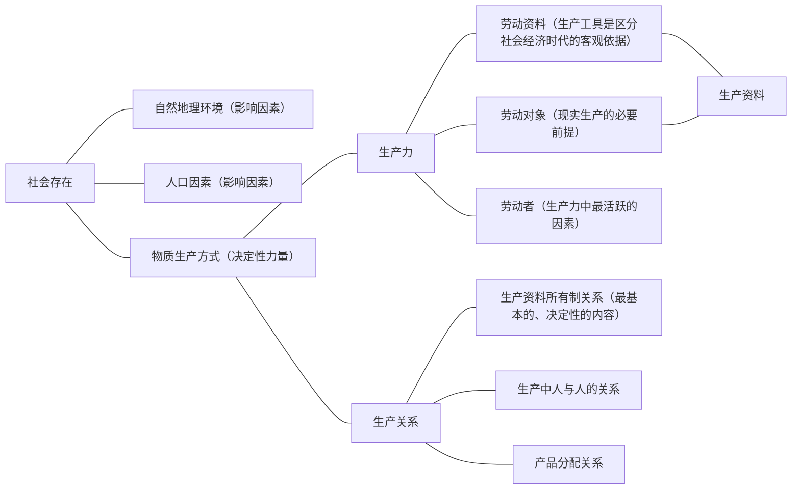
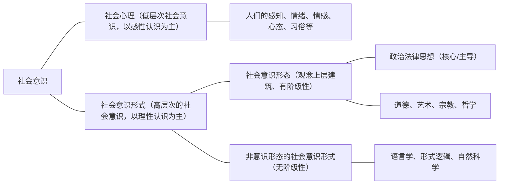
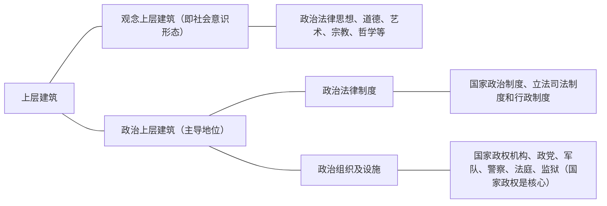

# 一、社会存在与社会意识
哲学基本问题在历史观中的贯彻和表现就是历史观的基本问题，即社会存在与社会意识的关系问题。正确认识这一问题是解决其他社会历史观问题的基础和前提。
## （一）两种根本对立的历史观
1. 两种根本对立的历史观。历史观是人们在认识社会历史现象、解决社会问题时所采取的根本观点。在对待社会历史发展及其规律问题上，存在着两种根本对立的观点：一种是唯物史观（认为社会存在决定社会意识），另一种是唯心史观（认为社会意识决定社会存在）。主张社会存在决定社会意识，还是社会意识决定社会存在，是唯物史观与唯心史观的根本分野。
2. 在马克思主义产生之前，唯心史观一直占据统治地位。唯心史观的主要缺陷：一是至多考察了人的活动的思想动机，而没有进一步考究思想动机背后的物质动因和经济根源；二是只看到个人在历史上的作用，而忽视人民群众创造历史的决定作用。
3. 唯物史观的创立。马克思发现了人类社会发展的客观规律，科学地解决了社会存在与社会意识的关系问题，创立了唯物史观。唯物史观实现了自然观与历史观在唯物主义基础上的统一，把人们对社会历史的认识，从唯心史观的统治下彻底解放出来；给社会历史的研究提供了科学的理论和方法；把对社会主义的研究奠定在实践的基础之上，从而使社会主义成为科学。
## （二）社会存在%%重要%%
社会存在也称社会物质生活条件，是社会生活的物质方面，主要包括自然地理环境、人口因素和物质生产方式。

1. 自然地理环境是人类社会生存和发展的永恒的、必要的条件，是人们生活和生产的自然基础。人口因素是社会存在和发展的必要条件，它对社会发展起着重要作用。自然地理环境和人口因素对社会发展起着加速或延缓的作用，但都不能脱离社会生产而发生作用，都不能决定社会的性质和社会形态的更替。
2. 
	- 物质生产方式是指人们为获取物质生活资料而进行的生产活动的方式，它是生产力和生产关系的统一体，集中地体现了人类社会的物质性。生产方式就是劳动者和劳动资料结合的特殊方式。生产方式中的生产力体现着人们改造自然的现实的物质力量，生产关系是人们在物质生产中发生的“物质的社会关系”，生产力和生产关系的统一所构成的生产方式使自然界的一部分转化为社会物质生活条件，使生物的人上升成为社会的人。
	- 生产方式是社会历史发展的决定力量。
		- 第一，物质生产活动及生产方式是人类社会赖以存在和发展的基础，是人类其他一切活动的首要前提。
		- 第二，物质生产活动及生产方式决定着社会的结构、性质和面貌，制约着人们的经济生活、政治生活和精神生活等全部社会生活。
		- 第三，物质生产活动及生产方式的变化发展决定整个社会历史的变化发展，决定社会形态从低级向高级的更替和发展。

>**经典真题**
1.（2011年单选第2题）社会存在是指社会的物质生活条件，它有多方面的内容，其中最能集中体现人类社会物质性的是
A.社会形态 
B.地理环境
C.人口因素
D.生产方式√
## （三）社会意识
社会意识是社会生活的精神方面，是社会存在的反映。社会意识具有复杂的结构：根据不同的主体，社会意识分为个体意识和群体意识；根据不同的层次，社会意识分为社会心理和社会意识形式。在社会意识形式中，又存在社会意识形态和非意识形态之分。属于上层建筑的社会意识形式称为社会意识形态，主要包括政治法律思想、道德、艺术、宗教、哲学等。在阶级社会中，占统治地位的思想文化，本质上是经济上占统治地位的阶级的意识形态，因而具有鲜明的阶级性。

>**拓展与点拨**
自然界包括了人类活动尚未触及的自在自然以及打上人类活动印记的人化自然。当今世界出现的生态、环境、人口、资源等全球危机问题，究其原因，并不单纯是自然系统内平衡关系的严重破坏，实际上也是人与自然关系的严重失衡。马克思认为，应当合理地调节人与自然之间的物质变换，在最无愧于和最适合人类本性的条件下进行这种物质变换。
## （四）社会存在和社会意识的辩证关系%%重要%%
社会存在决定社会意识，社会意识是社会存在的反映，并反作用于社会存在。
### 1．社会存在决定社会意识
第一，社会存在是社会意识内容的客观来源，社会意识是社会物质生活过程及其条件的主观反映。社会意识根源于社会存在，是对以实践为基础的不断发展变化的现实世界的反映。

第二，社会意识是人们进行社会物质交往的产物。交往活动是在生产活动中形成的一种人类活动的重要方式，社会意识同语言一样，是在生产中由于交往活动的需要而产生的。随着生活和交往的发展，人们的社会意识也同时改变。

第三，随着社会存在的发展，社会意识也相应地或迟或早地发生变化和发展。社会意识是具体的、历史的，每一时代的社会意识都有其独特的内容和特点，但不管怎样变化、发展，其根源总是深藏于经济事实当中。这是社会意识对社会存在的依赖性。
### 2．社会意识既依赖于社会存在，又具有相对独立性
- 社会意识在从根本上受到社会存在决定的同时，还有自己特有的发展形式和规律，主要表现在：
	- 第一，社会意识与社会存在发展的不完全同步性和不平衡性。进步的社会意识可以在一定程度上预见、推断未来，指导人们的实践活动；落后于社会存在的社会意识则阻碍社会的发展。另外，历史上也有这样的情况：社会经济发展水平较高的国家或地区，其社会意识的发展水平未必都是最高的；某些经济水平相对落后的国家或地区，其社会意识的某些方面却可以领先于经济发达的国家或地区。
	- 第二，社会意识内部各种形式之间的相互影响及各自具有的历史继承性。例如，一定历史发展阶段上的社会意识，在内容上主要是反映现实的社会存在，但同时也会吸收、保留以往形成的某些思想材料，即“古为今用”；在形式上继承以往既有的方式和方法，同时又根据新的内容和条件加以改造、补充和发展，并增添一些新的形式，即“推陈出新”。
	- 第三，社会意识对社会存在能动的反作用。这是社会意识相对独立性的突出表现。社会意识在一定条件下会转化为物质力量并作用于社会存在，影响历史的发展。先进的社会意识，反映了社会发展的客观规律，对社会发展起着积极的促进作用；落后的社会意识不符合社会发展的规律，对社会发展起着阻碍的作用。

>**拓展与点拨**
>1. 并非只有先进的社会意识才能对社会存在发挥反作用。不论是先进的社会意识，还是落后的社会意识，都会对社会存在产生反作用，只不过反作用的性质不同而已。
>2. 社会意识的能动作用是通过指导人们的实践活动实现的。思想本身并不能实现什么，要实现思想就要诉诸实践。
## （五）社会存在和社会意识辩证关系原理的意义
第一，它在人类思想史上第一次正确解决了社会历史观的基本问题，是社会历史观革命性变革的基础。唯物史观对历史观基本问题的科学回答，宣告了唯心史观的彻底破产，使对社会历史的研究真正成为科学，从而揭示了人类社会发展的规律。

第二，它对于社会发展包括社会文化建设具有重要指导意义。文化是社会意识的重要组成部分。文化对社会发展的重要作用主要表现在“四为”：为社会发展提供思想保证；为社会发展提供精神动力；为社会发展提供智力支持；为社会发展提供凝聚力量。
# 二、社会基本矛盾及其运动规律
## （一）生产力与生产关系的矛盾运动及其规律%%重要%%
### 1．生产力
1. 含义。生产力是人类在生产实践中形成的改造和影响自然以使其适合社会需要的物质力量。生产力具有客观现实性和社会历史性。深入理解生产力范畴，需要把握生产力的水平、性质、状况和发展要求等重要方面。生产力的水平表现为生产发展的现实程度；生产力的性质取决于生产的物质技术性质，主要是劳动资料的性质；生产力状况是这两者的统一，表现为生产力的运行状态或发展态势。
2. 结构。生产力具有复杂的系统结构。其基本要素包括：
	1. 劳动资料，也称劳动手段。它是人们在劳动过程中所运用的物质资料或物质条件，是人和劳动对象之间的媒介。其中最重要的是生产工具。生产工具是生产力发展水平的客观尺度，是区分社会经济时代的客观依据（物质标志）。
	2. 劳动对象。一切自然物质都是可能的劳动对象，其中引入生产过程的部分则是现实的劳动对象（包括未经加工的自然物和已经加工的物体）。劳动对象是现实生产的必要前提（劳动只有同劳动对象相结合，才构成现实生产力），它从一个侧面反映和体现了生产力的发展水平。不同的劳动对象直接制约着生产力的发展水平。劳动资料和劳动对象合称生产资料。
	3. 劳动者。劳动者是具有一定生产经验、劳动技能和知识，能够运用一定劳动资料作用于劳动对象、从事生产实践活动的人。劳动者是生产力中最活跃的因素。生产资料和劳动者相结合，才能变为现实生产力。

>**拓展与点拨** 
马克思：“各种经济时代的区别，不在于生产什么，而在于怎样生产，用什么劳动资料生产。”

3. 科学技术是生产力中的重要因素。科学技术能够应用于生产过程，与生产力中的劳动资料、劳动对象和劳动者等因素相结合而转化为实际生产能力。科学技术是先进生产力的集中体现和主要标志，是第一生产力。
### 2．生产关系
1. 含义。生产关系是人们在物质生产过程中形成的不以人的意志为转移的经济关系。生产关系是社会关系中最基本的关系。政治关系、家庭关系、宗教关系等其他社会关系，都受生产关系的支配和制约。
2. 内容。生产关系包括生产资料所有制关系、生产中人与人的关系和产品分配关系。在生产关系中，生产资料所有制关系是最基本的、决定性的，它是人们进行物质资料生产的前提，构成全部生产关系的基础，是区分不同生产方式、判定社会经济结构性质的客观依据。
3. 分析生产关系必须透过“物”看到“物”后面的人与人的关系，生产关系具有客观性。
生产关系是一种客观的物质的社会关系。生产关系虽然是一种人和人的关系，但它是在物质生产过程中结成的关系，是不以人的意志为转移的。首先，生产关系具有客观性，本质上是生产力的社会存在形式，人们不能离开生产力的发展状况自由地选择生产关系，也不能任意改变生产关系。其次，生产关系是一种物质利益关系，它体现着人们之间的物质经济利益，不是人们的主观愿望和要求。
### 3．生产关系一定要适合生产力状况的规律（人类社会发展的基本规律）%%重要%%
#### （1）生产力与生产关系的相互关系
生产力和生产关系是社会生产不可分割的两个方面。在社会生产中，生产力是生产的物质内容，生产关系是生产的社会形式，二者的有机结合和统一构成社会的生产方式。生产力与生产关系的相互关系是：生产力决定生产关系，而生产关系又反作用于生产力。

第一，生产力决定生产关系。在二者的矛盾运动中，生产力是居支配地位、起决定作用的方面。首先，生产力状况决定生产关系的性质。有什么样的生产力，就会产生什么样的生产关系。其次，生产力的发展决定生产关系的变化。生产关系是生产力发展需要的产物，只有当它为生产力提供足够的发展空间时才能够存在。

>**拓展与点拨**
马克思：“手推磨产生的是封建主的社会，蒸汽磨产生的是工业资本家的社会。”

第二，生产关系对生产力具有能动的反作用。主要表现为两种情形：当生产关系适合生产力发展的客观要求时，它对生产力的发展起推动作用；当生产关系不适合生产力发展的客观要求时，它就会阻碍生产力的发展。生产关系对生产力反作用的实际过程和情形是十分复杂的。例如：生产关系落后于生产力固然会阻碍其发展；而由于人为的原因使某种生产关系“超越”生产力水平，这种“拔高”了的生产关系也会阻碍生产力的发展。当不变革旧的生产关系，生产力就不能继续发展的时候，生产关系对生产力发展的反作用尤为突出。

生产关系对生产力的反作用归根到底还是由生产力决定的，生产关系对生产力反作用的性质也是取决于它是否适合生产力的状况。因此，判断一种生产关系是否优越的标准，在于这种生产关系对生产力是适合的还是不适合的，是促进还是阻碍生产力发展。不能离开生产力的状况和要求，孤立地、抽象地看待生产关系。
#### （2）生产力与生产关系矛盾运动规律
生产力与生产关系的相互作用是一个过程，表现为二者的矛盾运动。这种矛盾运动中的内在的、本质的、必然的联系，就是生产关系一定要适合生产力状况的规律，亦称生产力与生产关系的矛盾运动规律。这是人类社会发展的基本规律。

- 这一规律就内容看，包括两个方面：
	- 第一，生产力的状况决定一定的生产关系的产生及其变化发展的方向和形式；
	- 第二，生产关系反作用于生产力，当生产关系适合生产力的状况时对生产力发展起着促进作用，反之将起着阻碍作用。
- 从过程上看，这一规律表现为生产关系对于生产力总是从基本相适合到基本不相适合，再到基本相适合；与此相适应，生产关系也总是从相对稳定到新旧更替，再到相对稳定。生产力和生产关系的这种矛盾运动循环往复、不断推动社会生产发展，进而推动整个社会逐步走向更高阶段。生产关系一定要适合生产力状况的规律是社会形态发展的普遍规律。
#### （3）生产力与生产关系矛盾运动规律的原理的意义
第一，理论意义。这一原理在人类思想史上彻底否定了以“道德说教”作为评判历史功过是非的思想体系，第一次科学地确立了生产力发展是“社会进步的最高标准”，并且把生产力和生产关系矛盾运动的规律作为判断时代变革的客观依据。

第二，现实意义。这一原理是马克思主义政党制定路线、方针、政策的重要依据。

>经典真题
2.（2019年单选第3题）马克思指出，判断一个变革时代不能以该时代的意识为依据，相反，这个意识必须从物质生活的矛盾中去解释。这里的“物质生活的矛盾”从根本上说是
A.社会生产力与生产关系的现存冲突√
B.经济基础与上层建筑的现存冲突
C.人类社会与自然界的现存冲突
D.社会存在与社会意识的现存冲突
## （二）经济基础与上层建筑的矛盾运动及其规律
经济基础与上层建筑矛盾运动的规律，是人类社会发展的又一基本规律。
### 1．经济基础的含义
经济基础是指由社会一定发展阶段的生产力所决定的生产关系的总和。理解经济基础的内涵，要把握两点：第一，社会的一定发展阶段上往往存在多种生产关系，但决定一个社会性质的是其占支配地位的生产关系。第二，经济基础与经济体制具有内在联系。
### 2．上层建筑的含义
#### （1）上层建筑是建立在一定经济基础之上的意识形态以及与之相应的制度、组织和设施
自原始社会解体以来，上层建筑由意识形态以及政治法律制度及设施和政治组织两部分构成。意识形态又称为观念上层建筑，包括政治法律思想、道德、艺术、宗教、哲学等思想观点。政治法律制度及设施和政治组织又称为政治上层建筑，包括国家政治制度、立法司法制度和行政制度，以及国家政权机构、政党、军队、警察、法庭、监狱等政治组织形态和设施。
#### （2）观念上层建筑和政治上层建筑的关系
首先，政治上层建筑是在一定意识形态指导下建立起来的，是统治阶级意志的体现。其次，政治上层建筑一旦形成，就成为一种现实的力量，影响并制约着人们的思想理论观点。

#### （3）国家的起源和实质%%重要%%
在整个上层建筑中，政治上层建筑居主导地位，国家政权是核心。国家不是从来就有的，它是社会发展到一定历史阶段的产物，是阶级矛盾不可调和的产物。国家的实质是一个阶级统治另一个阶级的工具。国家和社会完全统一之日，也就是国家消亡之时。国家的消亡是个漫长的历史过程。
### 3.上层建筑一定要适合经济基础状况的规律（人类社会发展的又一基本规律）%%重要%%
- 经济基础与上层建筑是辩证统一的。经济基础决定上层建筑，上层建筑反作用于经济基础，二者相互影响、相互作用。
1. 经济基础决定上层建筑。
	2. 第一，经济基础的需要决定上层建筑的产生。
	3. 第二，经济基础的性质决定上层建筑的性质。由于占统治地位的生产关系决定经济基础的性质，因而它必然对上层建筑起主导作用，并决定上层建筑的性质。
	4. 第三，经济基础的变更必然引起上层建筑的变革，并决定其变革的方向。上层建筑的各个部分，由于具有不同程度的相对独立性，其改变有早有晚、有快有慢，虽不是同时的立即的改变，但变化是必然的。
2. 上层建筑对经济基础具有反作用。反作用集中表现在为自己的经济基础的形成和巩固服务。上层建筑这种反作用的后果有两种：当它为适合生产力发展要求的经济基础服务时，就成为推动社会发展的进步力量；反之，当它为落后的经济基础服务时，就成为阻碍社会发展的消极力量。上层建筑反作用的性质，取决于它所服务的经济基础的性质，归根到底取决于它是否有利于生产力的发展。上层建筑的反作用是巨大的，但并不是无限的，它是在经济基础起决定作用前提下的反作用。
3. 经济基础与上层建筑的相互作用构成二者的矛盾运动。上层建筑根源于经济基础，但作为一种超经济的力量，它又超越于经济基础，一旦形成，就成为一种相对独立的力量，有脱离经济基础的倾向，使经济基础的变化（经济基础总会发生变化）不会立即在上层建筑中得到反映，造成上层建筑落后于经济基础的情况。也就是说，上层建筑既具有对经济基础的依赖性，又具有相对独立性，这就使上层建筑不会完全地、绝对地适应经济基础的需要，它们之间总会有矛盾。

>**拓展与点拨**
经济基础与上层建筑的矛盾运动在实际运行中是极为复杂的。比如：同一性质的上层建筑的不完善部分会同经济基础发生矛盾；占统治地位的经济基础同旧上层建筑的残余、未来上层建筑的萌芽之间的矛盾；新旧上层建筑之间、新旧经济基础之间的矛盾；同一社会形态发展的不同阶段（上升发展阶段与没落时期），上层建筑同经济基础的矛盾又有不同的情况；等等。

4. 经济基础与上层建筑之间的内在联系构成了上层建筑一定要适合经济基础状况的规律。这里的“一定要适合”是指：经济基础状况决定上层建筑的发展方向，决定上层建筑相应的调整或变革，而不允许上层建筑长时期落后于或不适应自己的发展；上层建筑的反作用，也必须取决于和服从于经济基础的性质和客观要求，而不允许上层建筑脱离经济基础的发展状况和水平。
5. 上层建筑一定要适合经济基础状况的规律的意义：在当代中国，必须正确把握经济基础与上层建筑矛盾运动过程中存在的各种利益关系，并在深化经济体制改革、完善社会主义经济基础以促进生产力发展的同时，加快上层建筑领域的改革，以适应生产力发展和巩固经济基础的要求。

>**经典真题**
3.（2012年多选第18题）2011年4月，耶鲁大学出版了《马克思为什么是对的》一书，书中列举了当前西方社会10个典型的歪曲马克思主义的观点。其中一种观点认为：马克思主义将世间万物都归结于经济因素，艺术、宗教、政治、法律、道德等都被简单地视为经济的反映，对人类历史错综复杂的本质视而不见，而试图建立一种非黑即白的单一历史观。上述观点是对马克思主义关于经济基础和上层建筑辩证关系思想的严重歪曲，其表现为
A.把社会历史发展多重因素的综合作用歪曲为单一因素决定论√
B.把上层建筑与经济基础的相互作用歪曲为机械的单向作用√
C.把经济作为社会的“基础”所具有的归根到底的决定作用歪曲为唯一决定作用√
D.把意识形态对社会历史始终具有的积极能动作用歪曲为消极被动作用

# 三、人类普遍交往与世界历史的形成发展
## （一）交往及其作用
### 1．交往是唯物史观的重要范畴，是人类实践活动的重要组成部分
总体来说，可以把交往划分为物质交往和精神交往。物质交往是精神交往的基础和根源，精神交往是物质交往的产物，渗透于物质交往之中。
### 2．交往对社会生活的作用
促进生产力的发展；促进社会关系的进步；促进文化的发展与传播；促进人的全面发展。
## （二）世界历史的形成与发展
### 1．世界历史的含义
世界历史是指各民族、国家通过普遍交往，打破孤立隔绝的状态，进入相互依存、相互联系的世界整体化的历史。
### 2．世界历史的形成与发展
1. 生产方式的发展变革是世界历史形成和发展的基础。资本主义生产方式的发展和交往的普遍化推动了历史向世界历史的转变。人类历史向世界历史的转变是资本主义生产方式出现和向世界扩张的结果。世界历史的形成又反过来促进了生产力的普遍发展和人类的普遍交往，推动了社会发展，为人的发展创造了条件。
2. 普遍交往是世界历史的基本特征。
3. 世界历史的形成与发展为共产主义的实现提供了条件和路径。
4. 要站在世界历史的高度审视当今世界发展趋势和面临的重大问题，推动构建人类命运共同体。
# 四、社会形态更替的一般规律及特殊形式
## （一）社会形态的内涵%%重要%%
社会形态是关于社会运动的具体形式、发展阶段和不同质态的范畴，是同生产力发展一定阶段相适应的经济基础与上层建筑的统一体。经济基础是社会的“骨骼系统”；上层建筑是社会的“血肉系统”。社会形态包括社会的经济形态、政治形态和意识形态，是三者的历史的、具体的统一。社会制度被视为社会形态的同义语。
## （二）社会形态更替的统一性和多样性%%重要%%
- 社会形态发展的统一性与多样性，根源于社会发展的客观必然性与人们的历史选择性相统一的过程。
	1. 社会形态更替的统一性。依据生产关系的不同性质，社会历史可划分为五种社会形态：原始社会、奴隶社会、封建社会、资本主义社会和共产主义社会（其第一阶段是社会主义社会）。这五种社会形态依次更替，是社会历史运动的一般过程和一般规律，表现了社会形态更替的统一性。马克思认为这是自然历史过程。
	2. 社会形态更替形式的多样性。人类的总体历史过程表现为五种社会形态的依次更替，但是就某一国家或民族的社会发展的历程而言，情况就不一样了。有些国家在发展中超越了一种或几种社会形态而跨越式地向前发展；即使是同一种社会形态，在不同国家也会显现出不同特点。
	社会形态更替的多样性并不能否定人类总体历史过程。某些民族可以实现跨越，但其跨越的方向、跨越的限度是受总体历史进程制约的。也就是说，跨越的方向要同人类总体历史进程相一致；实际存在着的社会形态及其生产力规定着跨越的限度，现实存在的较先进的社会形态对跨越具有导向作用。（例如，近代中国没有经过典型的资本主义阶段而直接过渡到社会主义社会）
## （三）社会形态更替的必然性与人们的历史选择性
1. 社会形态更替的必然性。社会形态更替的客观必然性，即社会发展过程中的决定性，是指社会形态依次更替的过程和规律是客观的，其发展的基本趋势是确定不移的。也就是马克思所说的社会发展是一种自然历史过程。社会形态更替归根结底是社会基本矛盾运动的结果。其中，生产力的发展具有最终的决定意义。生产力与生产关系矛盾运动的规律性，从根本上规定了社会形态更替的客观必然性。
2. 人们的历史选择性。如同其他社会规律一样，社会形态更替的规律，也是人们自己的社会行动的规律。规律的客观性并不否定人们历史活动的能动性，并不排斥人们在遵循社会发展规律的基础上，对于某种社会形态的历史选择性。人们的历史选择性包含三层意思：
	- 第一，社会发展的客观必然性造成了一定历史阶段社会发展的基本趋势，为人们的历史选择提供了基础、范围和可能性空间。
	-  第二，社会形态更替的过程也是一个主观能动性与客观规律性相统的过程。
	-  第三，人们的历史选择性，归根到底是人民群众的选择性。人们对于社会形态的历史选择，最终取决于人民群众的根本利益、根本意愿以及对社会发展规律的把握顺应程度。

>经典真题
4.（2018年多选第18题）社会形态的更替具有客观性和必然性，但这并不否定人们历史活动的能动性，并不排斥人们在遵循社会发展规律的基础上，对于某种社会形态的历史选择性。人们历史活动的能动性和选择性主要体现在
A.社会发展的客观必然性为人们的历史选择提供了基础、范围和可能性空间√
B.社会形态更替的过程是主体能动性与客观规律性相统一的过程√
C.人们的历史选择性归根结底是人民群众的选择性√
D.社会发展的客观过程由每一个参与历史活动的个人的主观意志所决定
## （四）社会形态更替的前进性与曲折性
社会形态的更替，还表现为历史的前进性与曲折性、顺序性与跨越性的统一。社会形态更替的前进性和顺序性主要是指五种社会形态依次演进的基本趋势，其历史过程是一个“扬弃”的过程，但它并不否认历史发展的曲折性和跨越性。一种新社会制度取代旧社会制度，有时并不是从旧社会制度发展较为充分的典型国家开始，而更易于在旧制度发展不很完善或者很不充分的地方突破。这既体现了社会形态更替过程的曲折性，又为社会形态更替的跨越性提供了条件和历史契机。社会发展过程的曲折性是指社会前进过程中所出现的反复、停滞和倒退现象。曲折前进是历史的普遍规律。

社会主义作为人类历史迄今最进步的社会形态，它的产生和发展具有某种跨越性，是合乎规律的。它走向成熟，取得最后胜利，必然要经过曲折复杂的斗争和长期发展的过程。